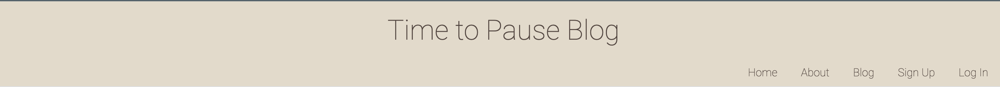
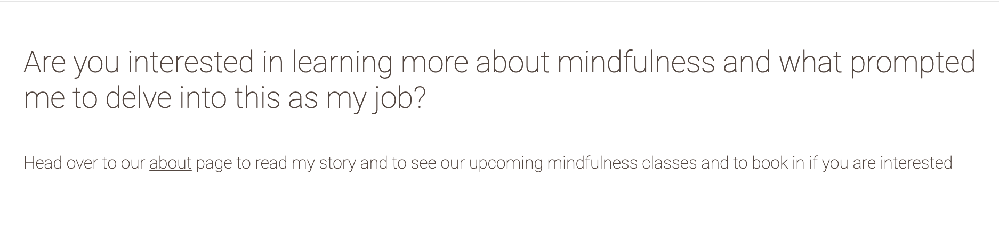
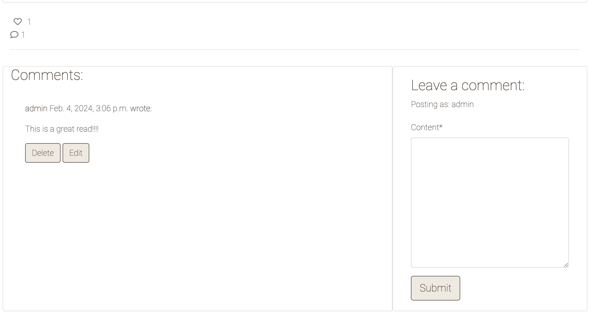

# Time to Pause Blog

Time to Pause Blog is a blog where people with an interest in mindfulness can come to read blog posts, create an account with the blog to be able to like and comment under blog posts and can also attend mindfulness classes by filling out a form to register their interest in doing so. 

## Project Set Up 

I created Mind Map on Ludic App for ideas of funcitonality of the blog as well as some additional add on features that I would like to include if I have sufficient time at the end of the project to implement. 

## Blog Plan
- I created a blog plan to brainstorm as to why this blog would be of value to users as well as why they would return regularly to the blog.

## User Stories
- User Story 1
    - As a busy Mom of three young children I would like somewhere I can go to drop into mindfulness when I have a spare minute at home but could not commit to going somewhere to attend a talk. An article or blog post would suit me better that I can read at anytime.

- User Story 2
    - As a shift worker my work pattern is unpredictable by nature and find it hard to commit to regularly scheduled classes, talks etc however I have recognised the need for a mindfulness practise in my life. I would like somewhere where I can log into at any time to learn more about mindfulness and can sign up to attend a class when suits me.
- User Story 3
    - As a young adult who has suffered with anxiety and has realised the value of mindfulness in my life and the need to stay connected to a mindfulness community as well as furthering my learning within mindfulness I would like somewhere where I can go and be my true self and fully engage in the community.

## Features 

### Navbar
- Fully responsive navbar with links to: Home, About, Blog, Log In and Sign Up.
- This navbar displays on all pages across the blog.
- Navbar adapts if user is signed in or not.
    * Displays a Sign Up and Log In tab if user is not signed in.
    

    * Displays a Log Out Tab if user is signed in. 
    

### Footer
- Responsive navbar with a message to engage with visitors to the blog.
- This appears on all pages across the blog to maintain the colours throughout the blog. 

### Home Page
- The home page welcomes users to the website and sets the tone for the overall website of a calm, open and warm website for all users.
- There is two large images on this page to set the overall vibe of the webpage and the mindful tone that will remain throught the blog. 
- There is a link here to bring users to the 'About' page to invite users to learn more about the Time to Pause Blog. 

- There is a section here also with an unordered list to invite users to take a few moments to engage in a guided meditation. 

- Below this there is a Member Testimonials Section consisting of two cards that display headings and content of feedback from users. 

- The styling of this page is matched to that of the navbar and footer which is maintained consistent throughout the blog.

### About Page
- The about page consists of a header content as well as a quote to welcome users to the page.

- There is a block of text content for 'My Story' and a picture below of a girl further reinforcing the mindful tone of the page.

- There is another block of text content for 'Why I started this blog' which explains to visitors to the page to explain more about the blog and to allow users to decide if this blog is resonating with them.
- At the bottom of the about page there is a form inviting users to complete it if they are interested in attending Mindfulness Classes. 
    - Users are asked to fill in their name, email address and availability of when they would like to attend.
    - This form contains necessary validation and will not let a user proceed unless an email in the correct format is entered.
    - When this is completed by a user it is visible to the admin logged in on the admin page and so this can be actioned from there. 

### Blog
- The blog page is set up using Bootstraps cards with two cards per row and four cards per page. 

- Each card contains an image for the specific blog post or a default image if none is uploaded with the blog post, the title of the blog post, an excerpt from the blog post, who the blog post is written by, when the blog post was wrote and how many likes the blog post has received also.
- The title of the blog can be clicked by the user to bring them to the full blog so they can read all the content of the blog post.
- In the full blog post users that have an account can like and comment under the blog posts. Users will be prompted to log in or sign up if they have not already done so.

- Once a comment is posted by a member these have to be approved by the admin before they display to all site users so a comment only visible to the member who placed the comment will appear stating 'Your comment is awaiting approval'. This will disappear once the comment is approved by the admin. This message also appears at the top of the page as a Django message to highlight to the user that their comment is awaiting approval

- Users with an account also have the option here to edit or delete any comments that they have already left under a blog post.
- If a user who is logged in selects the option to delete a comment a modal pop up appears to ask the user if they are sure they want to delete the comment so as to prevent content being deleted that shouldn't be.

- If a user hasn't an account they can still read the comments under a blog post and see the like count also.

### Sign Up
- The sign up page consists of a form from the Django framework that invites visitors to the website to create an account with Time To Pause Blog so they can join the mindfulness community and enable the benefits of being able to like and comment under blog posts as well as being able to edit and delete their own comments. 
- Users are asked to enter their desired username, email address and to create and re-enter a password.
- This form consists of the necessary validation that will not allow two users to have the same username, an email to be used that is in the incorrect format and all necessary password requirements in relation the length, password too similar to usernname and longer than 8 characters.

### Log In 
- The log in page asks members to enter their username and password to log in to allow users to make use of the blogs full user functionality.

### Sign Out 
- Users can sign out when they wish to do so. Here, they are asked to confirm if they would like to do so and if they do a message is displayed at the top of the page to confirm they have signed out.

## Setting Up Django Workspace

- I used the Django Blog Cheat Sheet from the 'I Think Therefore I Blog' course content in order to set up my workspace for use with Django and supporting libraries. 
- I installed the relevant libraries required which were Django, Gunicorn, Psycopg2, DJ Database URL, Cloudinary and URL Lib 3. 
- I created my app using the command python3 manage.py startapp "timetopause"
- I migrated these changes and then I ran the server to test was my workspace working using the relevant commands.
- I added my app name to the ALLOWED_HOSTS list in the settings.py file.
- Next, I used ElephantSQL to create an extrernal database to support my app. I have an account already with Elephant SQL so I logged into my account. I selected the 'Create New Instance Button' at the top right hand corner of the screen. From here I entered my app name, selected a plan on which I would like this datebase to run and I clicked on the 'Select Region' button at the bottom of the screen. On this page I checked that the region already selected was correct for me and once I had that confirmed I clicked on the 'Review' button at the end of the page. I reviewed the details of my database here and once I was happy with that I selected the button "Create Instance".
- Once I had this database connected I was returned to my dashboard, from here I clicked on the app I had just created which brought me to my app details. I copied the URL name here. 
- I now logged onto my Heroku account and navigated to the dashboard here. I selected the "New" button on the top right hand corner of the screen and selected "Create New App" from the list of options. From here I entered a name for my app and selected the correct region. I selected "Create App" from here.
- Once I had the app created and was returned to the homepage I selected the app I had just created and then clicked on the "Settings" tab from the app homepage. From here I selected to "Reveal Config Vars". Here I added a Config Var with the Key of DATABASE_URL and the value of the URL name I had copied from the database I had created in Elephant SQL. I selcted "Add" when both fields had been entered.
- Back in my Gitpod workspace for the app I created an env.py file in the top level directory. Here I imported os and added the database url and created a secret key for the project.
- I once again returned to Heroku and clicked into the Settings tab of my project and again revealed config vars and added a new Key of SECRET_KEY and a value of the secret key that I created for the project.
- In Gitpod I opened my settings.py file and using code imported os and dj database url. Here I also changed the code for the SECRET_KEY and set it to get the secret key value from where it was set. I also commented out the old code for the DATABASE value and added in code to point to my new database url that was specified.
- I saved all files and in the termnial I made migrations using the code python3 manage.py migrate.
- I have an account set up with Cloudinary also. This site is used to host images and media from the app to ensure they are always available. I logged into my Cloudinary account and from the dashboard I copied the API Environment Variable. 
- I added this to my env.py file as a separate line of code to point directly to my Cloudinary URL.
- I once again returned to my app created on Heroku and clicked on the Settings tab and revealed config vars. From here I added a key of CLOUDINARY_URL and the value of the API Environment Variable I copied from Cloudinary and I added this. Here I also added another Config Var with a key of DISABLE_COLLECTSTATIC with a value of 1. This was only added tempoarily and will be removed before deployment.
- Back in Gitpod in the settings.py file I added cloudinary and cloudinary_storage to INSTALLED_APPS. Here I also instructed Django to use Cloudinary to store media and static files. I also linked my file to the templates directory in Heroku using os.path.join. I also changed the TEMPLATES value to TEMPLATES_DIR in order to link them.
- I added my Heroku app name to the ALLOWED_HOSTS in the settings.py file also in the correct format. 
- In Gitpod I next created 3 folders in the top level directory of media, templates and static.
- Here I also created a file called Procfile. I added the following code to the Procfile web: gunicorn (timetopause).wsgi.
- I saved all my files. In the terminal I added my files to GitHub using git add ., git commit -m 'Deployment commit' and git push.
- From here I returned to my project in Heroku, I selected the Deploy tab, in the 'Deployment Method' I selected GitHub. In the textbox that appeared I entered my apps name as it appeared on GitHub confirmed it was the correct project. I scrolled down to the 'Manual Deploy' option and selected 'Deploy Branch'. I wacthed my build logs from here and selected to open the app once it was complete. 

## Features to be Implemented
Features I would like to implement as a long term goal to further enhance user experience would be:
- I would like to further enhance this blog page by allowing members to create their own blog posts and once approved will display on the main blog page where others can interact with. 
- Search functionality so that site visitors and members can search for posts containing a specific keyword.
- Further search functionality to allow users to click an an author of a blog post and as a result all posts written by that author would then be displayed to the user.

## Testing

### Validator Testing for CSS, HTML and Javascript
- The CSS style.css stylesheet passed through [W3C CSS Validation Service](https://jigsaw.w3.org/css-validator/) with no errors returned.

- The HTML pages that I created myself all passed through the [W3 Nu HTML Checker](https://validator.w3.org/nu/) with no errors returned. There was errors found within the framework code used for the sign up, sign out and log in pages which I did not amend as these were part of a framework. All code operated as expected. 
 

- The JS file was ran through [JS Hint Linter](https://jshint.com/) and no errors were found.

### Python Testing
- All Python files were passed through the [CI Python Linter](https://pep8ci.herokuapp.com/) and no errors were found.

### Manual Testing
- All manual testing was done with DEBUG = Falsen in the settings.py file.

|        Component     |       Test       |     Expected Result.      |           Actual Result         |
|----------------------|------------------|---------------------------|---------------------------------|
| Home page display as expected | Click on Home | Home page displayed | Home page displayed with expected formatting and images |
| About page link working | Selected About link | About page to display | About page displayed |
| About page displays | Click on About | About page to display as expected | About page displayed with expected formatting and images |
| Form to register interest | Fill in all form fields | Alert renders on admin about page | Alert appeared on admin and about page |
| Form fields | Skip completing form fields | Alert to please fill in field  | Alert appeared to fill in field |
| Email form field | Fill in email in incorrect format | Alert to include @ in email | Alert appeared to include @ for email |
| Blog list display | Click on Blog | List of blog posts appears as 4 per page | List of blog post displayed as 4 per page |
| Next and Prev Buttons | Work as expected | Next brings to next page, prev brings to previous | Next brought to next page, previious brought to previous list of blog posts |
| Full blog post display | On click of blog title in blog list full blog display | Full blog post displays | Full blog post displayed |
| Like Button | Click and Unclick Like | Notifies user of like and unlike | User notified of like and unlike and counter goes up |
| Log in Prompt | To display when not log in | Message display in like and comment to prompt a log in | Messaged displayed to visitor to log in to interact with post |
| Like Log in Prompt Link Working | Link to sign in page working | User brought to sign in page when clicked | User is brought to log in page when link |
| Comment | Member can leave a comment | User can leave a comment and receive confirmation | Member placed comment and received notification that comment is awaiting approval |
| Not logged in Comment | If not logged in cannot comment | Message displaying to prompt visitor to log in if they want to leave a comment | Message displayed to visitor to sign in to leave comment |
| Comment Log in Link | Link working | On click of link user brought to sign in page | User clicked log in link and brought to log in page |
| Edit Comment | Can only edit own comment | Only users own comment can be edited | User could only edit their comment and receive an alert to state they did so |
| Delete Comment | Users can delete own comments | Users can delete comment once confirmation received | User could delete a comment they left once confirming they were happy to do so |
| Sign Up Form | Working as expected | New user created as a result | All fields of form completed and new user created |
| Log In Link on Sign Up page | Link working | On click log in link brings to log in page | User brought to log in page once clicked |
| Sign In Field Validation | Field Validation | Alert user if field missed | Field missed on completing form and alert received to fill in missing field |
| Password Validation | Password | Alert raised if criteria not met | Alert raised as a result of not matching password or too similar to user name |
| Log In Form | Allows user to sign in | User can sign in and gain full functionality of blog | User signed in successfuly when correct credentials supplied |
| Sign Up Link on Log In Page | Link working | On click brought to sign up page | User brought to log in page once clicked |
| Sign Out | User can sign out | Sign out successfully and asked to confirm | User could sign out once they confirmed that was their intention|

 

## Credits

### Content
The content for this website was sourced from the below sites:
- The content for the blog posts was taken from [London Mindful Blog](https://londonmindful.com/)
- The guided mediation from the home page was taken from [Positive Psychology](Positivepsychology.com)

### Media
- Images:
    - Images for blog posts were taken with their corresponding blog post from [The Mindfulness Project](https://londonmindful.com/)
    - The placeholder image for the blog posts to be used when no image is inserted by the author is from [The Mindfulness Project](https://www.londonmindful.com/)
    - The first image on the homepage was taken from [Pexels](https://www.pexels.com/)
    - The second image on the homepage was taken from [Lifestyle Asia](https://www.lifestyleasia.com/sg/beauty-grooming/wellness/meditation-for-beginners-what-to-know-before-taking-the-spiritual-plunge/)
    - The first image on the about page was taken from [Mindful.org](https://www.mindful.org/a-meditation-for-decentering-your-self-and-why-you-should-do-it/)
    - The second image on the about page was taken from a journal cover being sold on [Amazon](https://www.amazon.com/Guided-Gratitude-Journal-Women-Inspirational/dp/B09S1YJCVW)

- Icons:
    - The icons for this website were sourced from [Font Awesome](https://fontawesome.com/v5/search)

- Font:
    - The font for this webpage is Josefin Sans and was taken from [Google Fonts](https://fonts.google.com/)

- Data Storing: 
    - [Elephant SQL](https://www.elephantsql.com/) was the database management system used
    - [Cloudinary](https://cloudinary.com/?&utm_campaign=1329&utm_content=instapagelogocta-selfservetest) was used for storing image files in the cloud

- Libraries and Frameworks 
    - [Bootstrap](https://getbootstrap.com/docs/4.6/getting-started/introduction/) was used to assist with the CSS styling
    - [Django](https://www.djangoproject.com/) was the web framework used